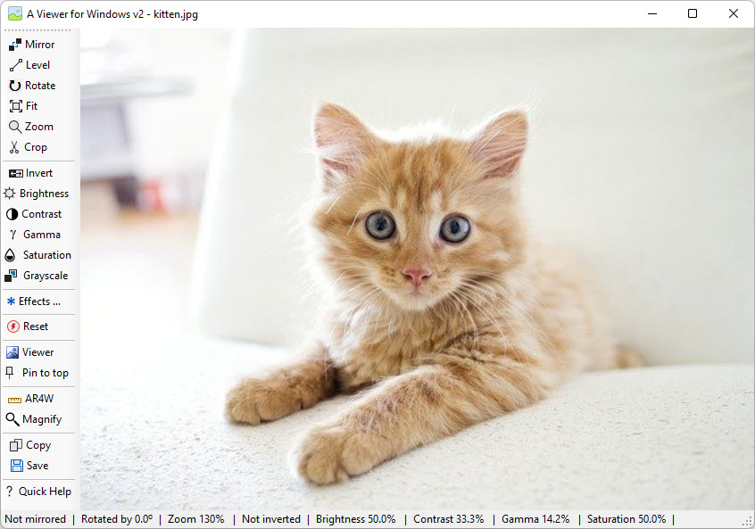

# A Viewer For Windows (version 2.1 - November 29, 2024)

A Viewer for Windows is a free open source program which lets you easily view, change and save images.  
  
It's especially useful when you need to work with other desktop applications while viewing an original or changed image.  

With A Viewer for Windows you can:
- quickly open an image,
- level, rotate, pan, zoom and crop it,  
- change its brightness, contrast, gamma, saturation, opacity,transparency and colors (including inverting them), 
- convert it to grayscale, and 
- create and apply your own custom effects  such as embossing, sharpening and blurring. 
 
The changed and original images can be viewed side by side, or one over the other, with the program automatically syncing them as they are panned, zoomed and rotated.  

Additionally, A Viewer for Windows can keep itself on top of other applications, ensuring your work is viewable at all times.
  
When you're done working, your image can be saved to a file or your clipboard.  
   
A Viewer for Windows integrates with [A Ruler for Windows](https://github.com/roblatour/ARulerForWindows) (also free), as well as Microsoft's Snipping and Magnify tools (both of which come with Windows).  

You're welcome to use A Viewer for Windows for free on as many computers as you like!

## Download 

To download the signed Windows installer program for A Viewer for Windows, please click [here](https://github.com/roblatour/AViewerForWindows/releases/download/v2.1.0.0/AViewerForWindowsSetup.exe)

## Support

